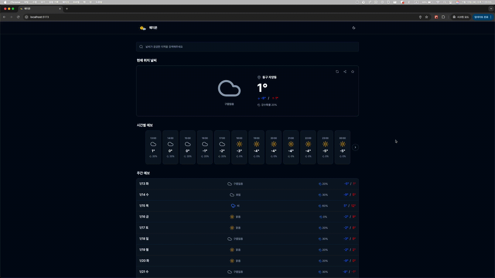
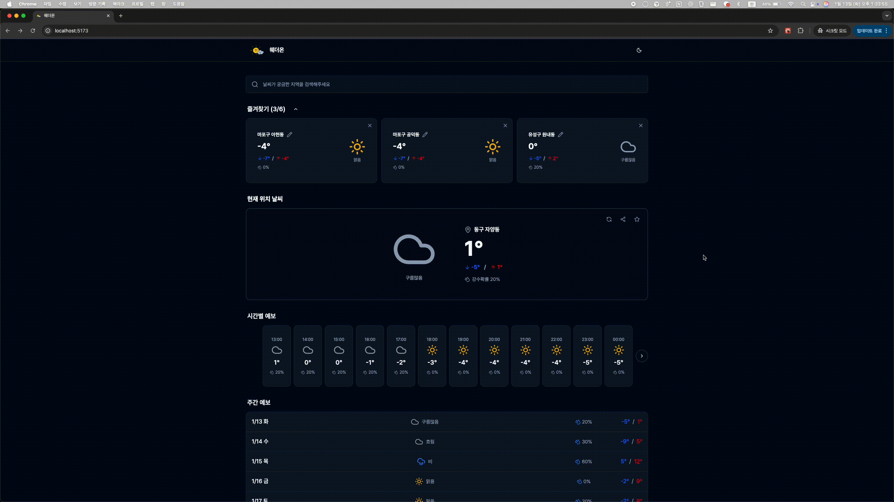
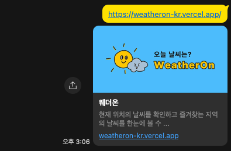
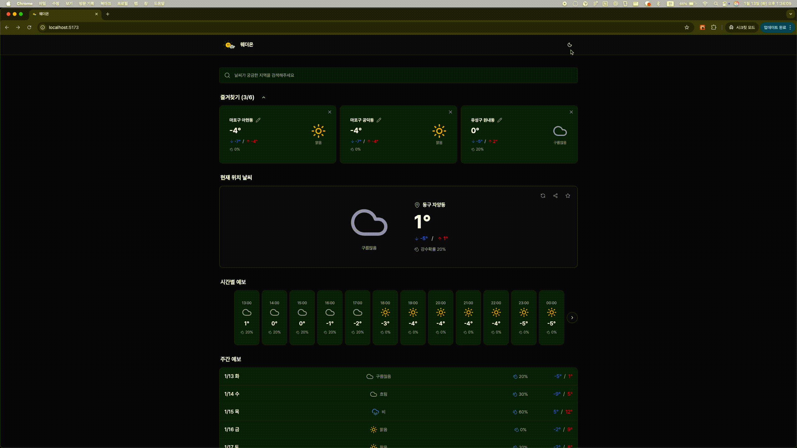

# 웨더온


기상청 공공데이터 API를 활용한 실시간 날씨 정보 제공 웹입니다.

- 배포 링크
  https://weatheron-kr.vercel.app/

## 주요 기능

### 현재 위치 기반 실시간 날씨

- 브라우저 Geolocation API를 통한 자동 위치 감지
- 현재 기온, 최저/최고 기온, 하늘 상태, 강수 확률 표시
- 위치 새로고침 버튼으로 수동 업데이트 가능


### 시간별 & 주간 날씨 예보

- 24시간 시간별 예보
- 10일 주간 예보 (단기예보 + 중기예보 결합)
- 오전/오후 날씨 구분, 최저/최고 기온, 강수 확률



### 지역 검색 & 즐겨찾기

- 전국 20,556개 법정동/행정동 검색 지원
- 최대 6개 즐겨찾기 저장
- 즐겨찾기 지역명 수정 기능
- 즐겨찾기 섹션 접기/펼치기 가능
- 동적 import로 초기 로딩 속도 최적화 (98.3% 감소)


### URL 공유 & 상세 페이지

- 특정 지역의 날씨 정보를 URL로 공유
- `/weather/:id` 형태의 동적 라우팅
- 공유 버튼으로 클립보드 복사






### 다크 모드 지원

- 라이트 모드, 다크 모드, 시스템 설정 따르기
- Zustand persist로 테마 설정 저장
- 부드러운 테마 전환



## 기술 스택

| 분류       | 기술                                                           |
| ---------- | -------------------------------------------------------------- |
| 언어       | TypeScript                                                     |
| 프레임워크 | React 18                                                       |
| 빌드 도구  | Vite                                                           |
| 상태 관리  | Zustand (클라이언트 상태), TanStack Query (서버 상태)          |
| 스타일링   | Tailwind CSS, shadcn/ui                                        |
| 라우팅     | React Router v7                                                |
| API        | 기상청 공공데이터 API, Nominatim Geocoding API (OpenStreetMap) |
| 아키텍처   | FSD (Feature-Sliced Design)                                    |
| 배포       | Vercel                                                         |

## 프로젝트 구조

```
src/
├── app/                    # 앱 설정 및 프로바이더
├── pages/                  # 페이지 컴포넌트
├── widgets/                # 복합 UI 블록
├── features/               # 기능 단위 컴포넌트
├── entities/               # 비즈니스 엔티티
├── shared/                 # 공유 리소스
│   ├── api/               # API 클라이언트
│   ├── lib/               # 유틸리티 함수
│   ├── store/             # 상태 관리
│   └── ui/                # 공통 UI 컴포넌트
└── components/            # shadcn/ui 컴포넌트
```

## 설치 및 실행

### 1. 저장소 클론

```bash
git clone <repository-url>
cd weather-app
```

### 2. 의존성 설치

```bash
npm install
```

### 3. 환경 변수 설정

프로젝트 루트에 `.env` 파일을 생성하고 다음 내용을 추가:

```env
# 기상청 API 키
VITE_WEATHER_API_KEY=기상청 API 키

# API 엔드포인트
VITE_SHORTTERM_API_BASE_URL=https://apis.data.go.kr/1360000/VilageFcstInfoService_2.0
VITE_MIDTERM_API_BASE_URL=https://apis.data.go.kr/1360000/MidFcstInfoService

```

### 4. 개발 서버 실행

```bash
npm run dev
```

브라우저에서 `http://localhost:5173`으로 접속합니다.

### 5. 프로덕션 빌드

```bash
npm run build
npm run preview
```

## 기술적 구현 상세

### 1. GPS 좌표 변환 시스템

- GPS 좌표(위도/경도) → 기상청 격자 좌표(nx, ny) 변환
- Lambert Conformal Conic 투영법 기반 좌표 변환 알고리즘
- Nominatim API를 통한 좌표 → 주소 역지오코딩

### 2. 날씨 데이터 통합

- 기상청 단기예보 API (0~3일)
- 기상청 중기예보 API (4~10일)
- 두 API 데이터를 결합하여 끊김 없는 10일 예보 제공
- 중기예보는 항상 06시 발표 데이터 사용 (Day 3, 4 데이터 보장)
- `/weather/:id` 형태의 동적 라우팅으로 즐겨찾기 지역 직접 접근
- 공유 버튼 클릭 시 현재 페이지 URL을 클립보드에 복사

## 기술적 의사결정

### 1. FSD (Feature-Sliced Design) 아키텍처 선택

**선택 이유:**

- 프로젝트의 확장성과 유지보수성을 고려한 아키텍처 필요
- 기능별로 명확한 책임 분리를 통해 코드의 가독성 향상
- 새로운 기능 추가 시 기존 코드에 미치는 영향 최소화

**구현 방식:**

- `app`: 앱 전체 설정 및 프로바이더
- `pages`: 라우팅 단위의 페이지 컴포넌트
- `widgets`: 복합 기능을 가진 독립적인 UI 블록 (CurrentWeatherHero, HourlyForecast 등)
- `features`: 사용자 인터랙션 기능 (SearchBar, FavoritesList 등)
- `entities`: 비즈니스 엔티티 (WeatherCard 등)
- `shared`: 공통 리소스 (API, 유틸리티, 상태 관리, UI 컴포넌트)

### 2. shadcn/ui + Lucide React 아이콘 선택

**선택 이유:**

- **shadcn/ui**: 복사-붙여넣기 방식의 컴포넌트 라이브러리

  - npm 패키지가 아닌 소스 코드 직접 복사 방식으로 완전한 커스터마이징 가능
  - Radix UI 기반으로 접근성(a11y) 기본 지원
  - Tailwind CSS와 완벽한 통합
  - 불필요한 컴포넌트 없이 필요한 것만 프로젝트에 추가 가능

- **Lucide React**: 가볍고 일관된 아이콘 세트
  - Tree-shaking 지원으로 사용하는 아이콘만 번들에 포함
  - 깔끔한 아이콘 제공
  - TypeScript 완벽 지원
  - 날씨 아이콘(Sun, Cloud, CloudRain 등)이 프로젝트와 잘 어울림

**구현 예시:**

```typescript
import { Moon, Sun, Monitor } from "lucide-react";
import { Button } from "@/components/ui/button";
```

### 3. 상태 관리 전략

**클라이언트 상태 (Zustand):**

- 즐겨찾기 데이터, 테마 설정 등 클라이언트 로컬 상태 관리
- persist 미들웨어로 localStorage 자동 동기화
- 가벼운 번들 크기 (3KB)와 직관적인 API

**서버 상태 (TanStack Query):**

- 날씨 데이터와 같은 서버 데이터 캐싱 및 동기화
- 자동 재검증, 백그라운드 업데이트, 에러 핸들링 기능 내장
- 로딩 상태와 에러 상태 관리 용이

### 4. GPS ↔ 기상청 격자 좌표 변환

**문제 상황:**

- 기상청 API는 일반적인 GPS 좌표(위도/경도)가 아닌 격자 좌표(nx, ny)를 사용
- GPS 좌표를 기상청 격자 좌표로 변환하는 과정 필요

**해결 방법:**

- `coordinate-converter.ts`에 변환 로직 구현
- GPS 좌표 → 격자 좌표 변환: `convertGpsToGrid()`
- 격자 좌표 → GPS 좌표 변환: `convertGridToGps()`
- [기상청 좌표 변환 알고리즘](https://gist.github.com/fronteer-kr/14d7f779d52a21ac2f16) 적용

**한계점:**

- 격자 간격이 5km로 넓어서 근처 지역도 같은 격자로 매핑될 수 있음
- 실제 관측소 위치와 다를 수 있어 날씨 앱과 2-3도 온도 차이 발생 가능

### 5. 단기예보 + 중기예보 결합

**문제 상황:**

- 단기예보 API: 0~3일 후까지만 제공
- 중기예보 API: 3~10일 후 제공 (발표 시각에 따라 4일 후부터 제공)
- 3~4일 사이 데이터 공백 발생 가능

**해결 방법:**

- `getDailyForecastFromShortTerm()`: 단기예보에서 0~3일 데이터 추출
- `getMidTermWeeklyForecast()`: 중기예보에서 4~10일 데이터 추출
- 두 데이터를 결합하여 끊김 없는 10일 예보 제공
- 중기예보는 항상 06시 발표 데이터 사용 (Day 3, 4 데이터 포함)

### 6. 주소 검색 최적화

**문제 상황:**

- 전국 20,556개 법정동/행정동 데이터 (954KB)
- 초기 번들에 포함 시 초기 로딩 속도 저하

**해결 방법:**

- `korea_districts.json` 동적 import로 지연 로딩
- 검색 기능 사용 시에만 데이터 다운로드
- 배열 `filter()` 메소드로 검색 구현
- 최대 15개 결과만 표시하여 렌더링 성능 최적화

**데이터 출처 및 구조:**

- 출처: 행정안전부 법정동코드 및 행정동코드 데이터
- 구조: `["시/도-시/군/구-읍/면/동"]` 형식의 문자열 배열
- 예시: `"서울특별시-종로구-청운동"`, `"대전광역시-동구-자양동"`
- 파일 위치: `src/shared/data/korea_districts.json`
- 사용: `SearchBar.tsx`에서 컴포넌트 마운트 시 동적 로드

**성능 개선:**

- 초기 HomePage 번들: 931KB → 15.77KB (98.3% 감소)
- 검색 데이터는 별도 청크(915KB)로 분리
- 검색 미사용 시 다운로드 불필요

### 7. 토스트 키보드 접근성

**구현 배경:**

- 즐겨찾기 삭제 확인 토스트에서 마우스 클릭만 지원
- 키보드 사용자의 접근성 개선 필요

**구현 내용:**

- 토스트 표시 시 Enter 키 이벤트 리스너 등록
- Enter 키 입력 시 삭제 액션 실행
- 액션 완료 또는 취소 시 이벤트 리스너 자동 제거
- 메모리 누수 방지를 위한 cleanup 패턴 적용

### 8. 성능 최적화

**코드 스플리팅:**

- React.lazy()로 페이지별 지연 로딩 구현
- Manual Chunks로 vendor 라이브러리 분리
- 초기 로딩 속도 대폭 개선

**번들 최적화:**

- react-vendor (96KB): React, React Router
- ui-vendor (86KB): lucide-react, radix-ui
- state-vendor (34KB): Zustand, TanStack Query
- utils-vendor (70KB): sonner, axios

## 트러블슈팅

### 1. 중기예보 "예보 준비중" 표시 문제

**원인:**

- 중기예보는 06시/18시에 발표되는데, 18시 발표 시 Day 3, 4 데이터가 누락될 수 있음

**해결:**

- `getMidTermForecastTime()` 함수에서 항상 06시 발표 데이터 사용하도록 수정
- 06시 발표 데이터는 Day 3, 4 데이터를 포함

### 2. 위치 권한 거부 시 처리

**구현:**

- Geolocation API 에러 처리 로직 추가
- 권한 거부 시 에러 메시지 표시 및 대체 기능 안내
- 검색 기능과 즐겨찾기를 통해 위치 권한 없이도 앱 사용 가능
